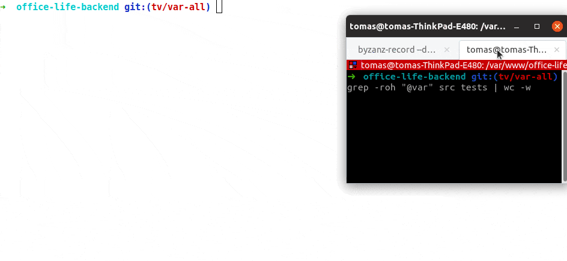

# Rector - Speedup Your PHP Development

[](https://coveralls.io/github/rectorphp/rector?branch=master)
[](https://packagist.org/packages/rector/rector)
[](https://sonarcloud.io/dashboard?id=rectorphp_rector)

<br>

Rector helps you with 2 areas - major code changes and in daily work.

- Do you have a legacy code base? Do you want to have that latest version of PHP or your favorite framework?
 → **Rector gets you there with instant upgrade**.

 <br>

- Do you have code quality you need, but struggle to keep it with new developers in your team? Do you wish to have  code-reviews for each member of your team, but don't have time for it?
→ **Add Rector to you CI and let it fix your code for you. Get [instant feedback](https://tomasvotruba.com/blog/2020/01/13/why-is-first-instant-feedback-crucial-to-developers/) after each commit.**

<br>

It's a tool that [we develop](https://getrector.org/) and share for free, so you anyone can automate their refactoring.

[Hire us](https://getrector.org/contact) to skip learning Rector, AST and nodes, to educate your team about Rectors benefits and to setup Rector in your project - so you can enjoy the 300 % development speed :+1:

<br>

- **[Try Rector Online](https://getrector.org/demo)**

## Show Case: Complete 2700 `@var` annotations in 2 mins



[How does this work?](https://tomasvotruba.com/blog/2019/01/03/how-to-complete-type-declarations-without-docblocks-with-rector/)

<br>

## Open-Source First

Rector **instantly upgrades and refactors the PHP code of your application**.
It supports all versions of PHP from 5.2 and major open-source projects:

<br>

<p align="center">
    <a href="/config/set/"></a>
    
    <a href="/config/set/"></a>
    
    <a href="https://github.com/palantirnet/drupal-rector/tree/master/config/drupal-8"></a>
    
    <a href="/config/set/"></a>
</p>

### What Can Rector Do for You?

- [Upgrade 30 000 unit tests from PHPUnit 6 to 9 in 2 weeks](https://twitter.com/LBajsarowicz/status/1272947900016967683)
- [Complete PHP 7.4 property type declarations](https://tomasvotruba.com/blog/2018/11/15/how-to-get-php-74-typed-properties-to-your-code-in-few-seconds/)
- [Migrate your project from Nette to Symfony](https://tomasvotruba.com/blog/2019/02/21/how-we-migrated-from-nette-to-symfony-in-3-weeks-part-1/)
- [Refactor Laravel Facades to Dependency Injection](https://tomasvotruba.com/blog/2019/03/04/how-to-turn-laravel-from-static-to-dependency-injection-in-one-day/)
- And much more...

<br>

## Documentation

- [Explore 600+ Rector Rules](/docs/rector_rules_overview.md)
- [How Does Rector Work?](/docs/how_it_works.md)
- [PHP Parser Nodes Overview](/docs/nodes_overview.md)

### Advanced

- [How To Run Rector on Changed Files Only](/docs/how_to_run_rector_on_changed_files_only.md)
- [How Run One Rule From Command Line](/docs/how_to_run_one_rule_from_command_line.md)
- [How to Ignore Rule or Paths](/docs/how_to_ignore_rule_or_paths.md)
- [How to Configure Rule](/docs/how_to_configure_rules.md)
- [How run Rector in Docker](/docs/how_to_run_rector_in_docker.md)
- [Add Checkstyle with your CI](/docs/checkstyle.md)

### Contributing

- [How to Add Test for Rector Rule](/docs/how_to_add_test_for_rector_rule.md)
- [How to Create New Rector Rule](/docs/create_own_rule.md)
- [How to Generate New Rector Rule with Recipe](/docs/rector_recipe.md)

## Install

```bash
composer require rector/rector --dev
```

- Having conflicts during `composer require`? → Use the [Rector Prefixed](https://github.com/rectorphp/rector-prefixed)
- Using a different PHP version than Rector supports? → Use the [Docker image](/docs/how_to_run_rector_in_docker.md)

<br>

## Running Rector

There a 2 main ways to use Rector:

- a *single rule*, to have the change under control - you can choose [from over 600 rules](/docs/rector_rules_overview.md)
- or group of rules called *sets* - pick from [sets](/config/set)

To use them, create a `rector.php` in your root directory:

```bash
vendor/bin/rector init
```

And modify it:

```php
<?php

// rector.php

declare(strict_types=1);

use Rector\Core\Configuration\Option;
use Rector\Php74\Rector\Property\TypedPropertyRector;
use Rector\Set\ValueObject\SetList;
use Symfony\Component\DependencyInjection\Loader\Configurator\ContainerConfigurator;

return static function (ContainerConfigurator $containerConfigurator): void {
    // here we can define, what sets of rules will be applied
    $parameters = $containerConfigurator->parameters();
    $parameters->set(Option::SETS, [SetList::CODE_QUALITY]);

    // register single rule
    $services = $containerConfigurator->services();
    $services->set(TypedPropertyRector::class);
};
```

<br>

Then dry run Rector:

```bash
vendor/bin/rector process src --dry-run
```

Rector will show you diff of files that it *would* change. To *make* the changes, drop `--dry-run`:

```bash
vendor/bin/rector process src
```

*Note: `rector.php` is loaded by default. For different location, use `--config` option.*

<br>

## Full Config Configuration

```php
<?php

// rector.php

declare(strict_types=1);

use Rector\Core\Configuration\Option;
use Symfony\Component\DependencyInjection\Loader\Configurator\ContainerConfigurator;

return static function (ContainerConfigurator $containerConfigurator): void {
    $parameters = $containerConfigurator->parameters();

    // paths to refactor; solid alternative to CLI arguments
    $parameters->set(Option::PATHS, [__DIR__ . '/src', __DIR__ . '/tests']);

    // Rector relies on autoload setup of your project; Composer autoload is included by default; to add more:
    $parameters->set(Option::AUTOLOAD_PATHS, [
        // autoload specific file
        __DIR__ . '/vendor/squizlabs/php_codesniffer/autoload.php',
        // or full directory
        __DIR__ . '/vendor/project-without-composer',
    ]);

    // is your PHP version different from the one your refactor to? [default: your PHP version]
    $parameters->set(Option::PHP_VERSION_FEATURES, '7.2');

    // auto import fully qualified class names? [default: false]
    $parameters->set(Option::AUTO_IMPORT_NAMES, true);

    // skip root namespace classes, like \DateTime or \Exception [default: true]
    $parameters->set(Option::IMPORT_SHORT_CLASSES, false);

    // skip classes used in PHP DocBlocks, like in /** @var \Some\Class */ [default: true]
    $parameters->set(Option::IMPORT_DOC_BLOCKS, false);

    // Run Rector only on changed files
    $parameters->set(Option::ENABLE_CACHE, true);
};
```

### Symfony Container

To work with some Symfony rules, you now need to link your container XML file

```php
<?php

// rector.php

declare(strict_types=1);

use Rector\Core\Configuration\Option;
use Symfony\Component\DependencyInjection\Loader\Configurator\ContainerConfigurator;

return static function (ContainerConfigurator $containerConfigurator): void {
    $parameters = $containerConfigurator->parameters();

    $parameters->set(
        Option::SYMFONY_CONTAINER_XML_PATH_PARAMETER,
        __DIR__ . '/var/cache/dev/AppKernelDevDebugContainer.xml'
    );
};
```

<br>

## How to Contribute

See [the contribution guide](/CONTRIBUTING.md).

<br>

### Debugging

You can use `--debug` option, that will print nested exceptions output:

```bash
vendor/bin/rector process src/Controller --dry-run --debug
```

Or with Xdebug:

1. Make sure [Xdebug](https://xdebug.org/) is installed and configured
2. Add `--xdebug` option when running Rector

```bash
vendor/bin/rector process src/Controller --dry-run --xdebug
```

<br>

## Community Packages

Do you use Rector to upgrade your code? Add it here:

- [palantirnet/drupal-rector](https://github.com/palantirnet/drupal-rector) by [Palantir.net](https://github.com/palantirnet) for [Drupal](https://www.drupal.org/)
- [sabbelasichon/typo3-rector](https://github.com/sabbelasichon/typo3-rector) for [TYPO3](https://typo3.org/)

## Known Drawbacks

### How to Apply Coding Standards?

Rector uses [nikic/php-parser](https://github.com/nikic/PHP-Parser/), that build on technology called *abstract syntax tree* (AST). AST doesn't care about spaces and produces mall-formatted code in both PHP and docblock annotations. **That's why your project needs to have coding standard tool** and set of rules, so it can make refactored nice and shiny again.

Don't have any coding standard tool? Add [ECS](https://github.com/Symplify/EasyCodingStandard) and use prepared [`ecs-after-rector.php`](/ecs-after-rector.php) set.
