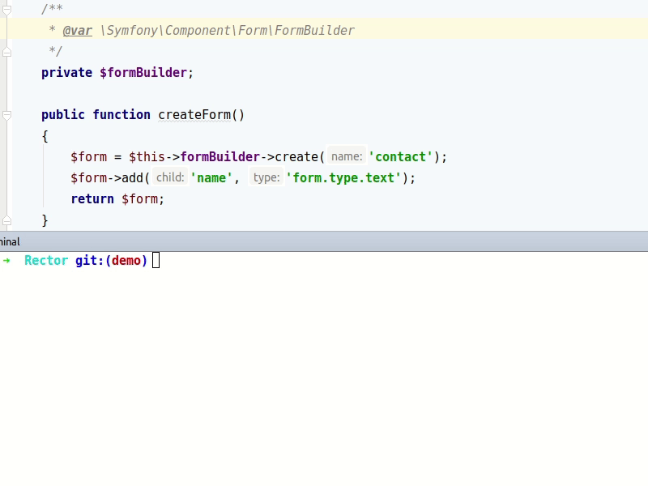

# Rector - Upgrade your Legacy App to Modern Codebase

Rector is a **rec**onstruc**tor** tool - it instantly upgrades and refactors your code to a modern one. It is under development phase in 2018, to figure out the best way to use it in applications, polish API of Rector classes and get feedback from community. Please consider this while using it and report issues or post ideas you'll come up with while using. Thank you!

When you're gonna move from manual work to **instant upgrades**?

[](https://travis-ci.org/rectorphp/rector)
[](https://packagist.org/packages/rector/rector)



Rector **instantly upgrades PHP & YAML code of your application**, with focus on open-source projects:

<p align="center">
    <a href="/config/level/symfony"></a>
    
    <a href="/config/level/sylius"></a>
    
    <a href="/config/level/phpunit"></a>
    
    <a href="/config/level/twig"></a>
</p>


**Rector can**:

- Rename classes, methods and properties
- Rename partial namespace
- Rename pseudo-namespace to namespace
- Add, replace or remove arguments
- Add arguments or return typehint
- Change visibility of constant, property or method
- And much more...

...just **look at overview of [all available Rectors](/docs/AllRectorsOverview.md)** with before/after diffs and configuration examples. It's all you really need to use build your own sets.

## Install

```bash
composer require rector/rector:@dev --dev
```

**Do you have conflicts on `composer require`?**

Install [prefixed version](https://github.com/rectorphp/rector-prefixed) with isolated dependencies.

### Extra Autoloading

Rector relies on project and autoloading of its classes. To specify own autoload file, use `--autoload-file` option:

```bash
vendor/bin/rector process ../project --autoload-file ../project/vendor/autoload.php
```

Or make use of `rector.yml` config:

```yaml
# rector.yml
parameters:
    autoload_files:
        - '%kernel.project_dir%/vendor/squizlabs/php_codesniffer/autoload.php'

    autoload_directories:
        - '%kernel.project_dir%/vendor/project-without-composer'
```

## How to Reconstruct your Code

### A. Prepared Sets

Featured open-source projects have **prepared sets**. You'll find them in [`/config/level`](/config/level).

Do you need to upgrade to **Symfony 4.0**, for example?

1. Run rector on your `/src` directory:

    ```bash
    vendor/bin/rector process src --level symfony40
    ```

    Which is a shortcut for using complete path with `--config` option:

    ```bash
    vendor/bin/rector process src --config vendor/rector/rector/src/config/level/symfony/symfony40.yml
    ```

    You can also use your **own config file**:

    ```bash
    vendor/bin/rector process src --config your-own-config.yml
    ```

2. Do you want to see the preview of changes first?

    Use the `--dry-run` option:

    ```bash
    vendor/bin/rector process src --level symfony33 --dry-run
    ```

3. What levels are on the board?

    ```bash
    vendor/bin/rector levels
    ```

### B. Custom Sets

1. Create `rector.yml` with desired Rectors:

    ```yml
    services:
        Rector\Nette\Rector\Application\InjectPropertyRector: ~
    ```

2. Try Rector on your `/src` directory:

    ```bash
    vendor/bin/rector process src --dry-run
    ```

3. Apply the changes if you like them:

    ```bash
    vendor/bin/rector process src
    ```

## How to Apply Coding Standards?

Rector uses [EasyCodingStandard](https://github.com/Symplify/EasyCodingStandard) to improve the code style of changed files, like import namespaces, make 1 empty line between class elements etc.

It's always better to use own project's prepared set, but if you don't have the option yet, just use `--with-style` option to handle these basic cases:

```bash
vendor/bin/rector process src --with-style
```

## More Detailed Documentation

- [How Rector Works?](/docs/HowItWorks.md)
- [How to Create Own Rector](/docs/HowToCreateOwnRector.md)
- [Service Name to Type Provider](/docs/ServiceNameToTypeProvider.md)

## How to Contribute

Just follow 3 rules:

- **1 feature per pull-request**
- **New feature needs tests**
- Tests, coding standards and PHPStan **checks must pass**:

    ```bash
    composer complete-check
    ```

    Don you need to fix coding standards? Run:

    ```bash
    composer fix-cs
    ```

We would be happy to merge your feature then.
